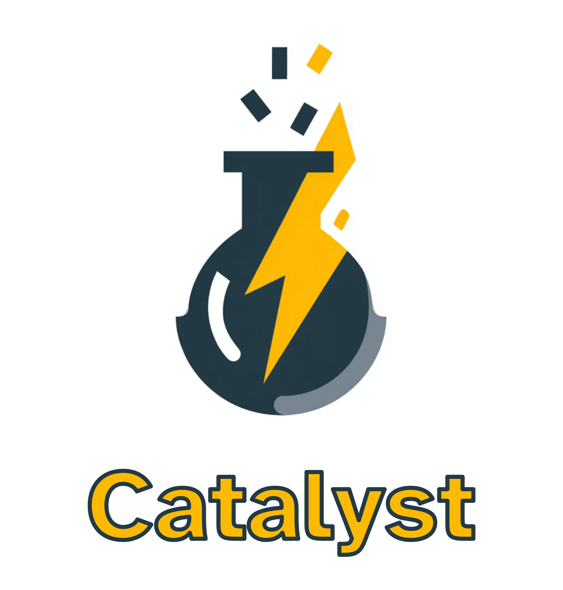

<h2 align="center">
  <br/>
  Catalyst
</h2>

<div align="center">
Turn complex documents into queryable knowledge systems for regulated industries.
No hallucinations - just accurate answers with full source attribution
</div>

<div align="center">
  <h2>
    <a href="https://pypi.org/project/com-blockether-catalyst/"></a>
    <a href="https://pypi.org/project/com-blockether-catalyst/"></a>
    <a href="https://github.com/Blockether/catalyst/blob/main/LICENSE">
      
    </a>
  </h2>
</div>

<div align="center">
<h3>

[Why Catalyst?](#why-catalyst) • [Quick Start](#quick-start) • [Features](#features) • [Examples](#examples)

</h3>
</div>

## Why Catalyst?

### The Problem

**Enterprises are drowning in unstructured documents.** Legal contracts, compliance policies, technical specifications, audit reports, financial statements, research papers - massive document repositories containing critical business knowledge that remains locked away and unsearchable. This knowledge is scattered across departments, creating silos where finance can't access legal precedents, engineering can't find compliance requirements, and executives can't get a unified view of organizational commitments.

**Current solutions fail at enterprise scale.** Simple keyword search misses context. Vector search without proper preprocessing fails on real documents - tables lose their structure, acronyms aren't linked to their definitions, and cross-page references are lost. Generic AI tools hallucinate when precision matters most. And when auditors or regulators ask for evidence, you need the exact source with full context - not an AI's interpretation or an isolated paragraph missing the conditions and requirements around it.

### Why Vector Search Alone Isn't Enough

**Acronym Hell**: Financial and regulated documents are packed with acronyms (SLA, KPI, GDPR, SOX). Vector embeddings can't connect "Service Level Agreement" with "SLA" appearing 50 pages later. Your search for "service levels" returns nothing because the document only uses "SLA".

**Corporate Jargon**: Industry-specific terms that don't exist in general training data. "Counterparty risk", "regulatory capital", "compliance framework" - these need domain understanding, not just semantic similarity.

**Missing Context**: Vector search finds individual paragraphs but misses the bigger picture. You ask about "payment terms" and get a random paragraph mentioning "30 days" without the surrounding context about penalties, conditions, or exceptions.

**Evidence Requirements**: In regulated environments, answers need the full context - not just text citations. When compliance metrics are in a table, you need that table in the response. When a process diagram explains the workflow, you need that image. Legal and financial work requires complete evidence: the text, the tables, the charts - everything relevant to support the answer.

### Our Approach

**Hybrid Intelligence**: Vector search for semantic understanding + keyword extraction for precise terminology + relationship mapping to connect concepts.

**Knowledge Graphs**: We extract acronyms, validate their meanings with LLMs, and build relationships between terms. Now "SLA" searches also find "Service Level Agreement" content.

**Structure Preservation**: Tables, images, and document hierarchy stay intact. You get the actual compliance table, not a text description of it.

**Source Attribution**: Every answer includes exact page numbers and document sections. No hallucinations - if we don't know, we say so.

## Quick Start

Install Catalyst directly from GitHub (PyPI release coming soon):

```bash
# Using uv (recommended)
uv add "com-blockether-catalyst[extraction,api] @ git+https://github.com/Blockether/catalyst.git"

# Or using pip
pip install "com-blockether-catalyst[extraction,api] @ git+https://github.com/Blockether/catalyst.git"
```

## Features

### Core Capabilities

- **🔍 In-Memory Hybrid Search**: Platform-independent vector + keyword search that runs anywhere (Lambda, containers, edge) - no external dependencies
- **📦 Embedded Model**: Ships with a lightweight embedder (~32MB) directly in the library - no API calls, no latency, works offline
- **📄 PDF Intelligence**: Extracts text, tables, images, and maintains document structure
- **🧠 LLM Consensus**: Multiple validation passes ensure extraction accuracy
- **🔗 Knowledge Graphs**: Automatically links acronyms, terms, and concepts across documents
- **📊 Structure Preservation**: Tables and charts remain intact, not converted to text
- **🎯 Source Attribution**: Every answer includes exact page numbers and document sections
- **🚀 Async Processing**: Built on ASGI for high-performance document pipelines
- **🔧 Zero Dependencies**: Fully self-contained - no vector DBs, no external services, deploy anywhere

### Integrations

- **Web UI**: Ready-to-deploy document Q&A interface with HTMX
- **Workflow Engine**: Agno integration for complex document processing pipelines
- **Visualization**: Knowledge graph and chunk relationship visualizations
- **MCP Server**: Model Context Protocol support for AI assistants

## SWOT Analysis

| **Strengths** 💪 | **Weaknesses** ⚠️ |
|---|---|
| ✅ **Regulatory Excellence**: Purpose-built for compliance and audit requirements | ⏱️ **LLM Latency**: Multiple LLM calls per document - prioritizes quality over speed |
| ✅ **Evidence-Based**: Complete source attribution with page numbers and sections | 💾 **Resource Intensive**: High RAM/CPU usage, more demanding than simple vector search |
| ✅ **Offline Capable**: Self-contained with embedded models - no API dependencies | 🤖 **Model Dependencies**: Best with GPT-4 level models, weaker models = weaker extraction |
| ✅ **Platform Agnostic**: Runs on Lambda, containers, edge - anywhere Python runs | ⚙️ **Not Real-Time**: Batch processing adds minutes, not milliseconds |
| ✅ **Deep Understanding**: Connects acronyms, jargon, and cross-document references | 🔧 **Complexity**: More components = more potential failure points |

| **Opportunities** 🎯 | **Threats (When to Avoid)** 🚫 |
|---|---|
| 📋 **Regulatory compliance**: Finding specific requirements across massive policy documents | 🔄 **High-frequency updates**: Documents changing every few minutes |
| ⚖️ **Legal due diligence**: Connecting related clauses and terms across contracts | ❓ **Simple FAQ systems**: Basic vector search is sufficient |
| 💰 **Financial analysis**: Linking risk metrics with their definitions and calculations | 🌍 **General knowledge**: Use ChatGPT directly |
| 📚 **Technical documentation**: Understanding system relationships and dependencies | ⚡ **Real-time requirements**: Need sub-second responses |
| 📊 **Audit support**: Providing complete evidence chains with source materials | |

## Examples

Check out these real-world examples:

- **[Legal Document Q&A](examples/BasicCalculatorExample.py)** - Contract analysis and compliance checking
- **[Research Knowledge Base](examples/KnowledgeBaseQAExample.py)** - Academic paper processing and search
- **[Knowledge Extraction Pipeline](examples/KnowledgeExtractionExample.py)** - Batch document processing

## License

MIT License - see [LICENSE](LICENSE) for details.
